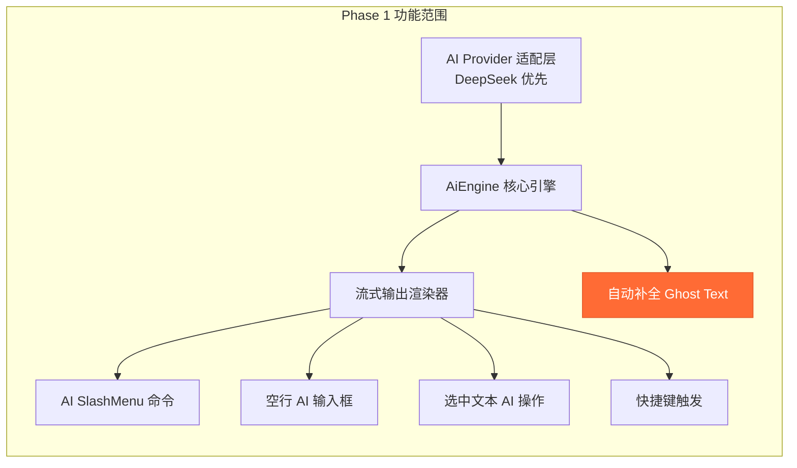

# xm-editor AI Phase 1 实现方案（修订版）

## 用户决策汇总

| 决策项 | 结论 |
|--------|------|
| LLM Provider | **DeepSeek** 优先适配 |
| 通信架构 | **前端直连 LLM API**（无后端代理） |
| 实施范围 | **Phase 1**（基础 AI + 自动补全） |
| UI 风格 | **飞书风格**，活力色彩 |
| 国际化 | **仅中文**，初期不考虑 |
| 配置策略 | 代码提供默认值，`temperature`/`systemPrompt`/`prompts` 作为高级配置可覆盖 |

---

## 一、Phase 1 功能清单



> [!IMPORTANT]
> **新增功能：自动补全 Ghost Text** — 用户停顿时自动显示灰色补全建议，按 `Tab` 采纳。
> 由于对实时性要求极高，支持为此功能**独立配置小参数模型**。

---

## 二、AI 配置设计

### 2.1 配置结构与默认值

```javascript
const editor = new XmEditor({
  el: '#editor',
  config: Presets.Basic.configure({
    ai: {
      // ===== 基础配置（必填） =====
      apiKey: 'sk-...',                    // DeepSeek API Key
      
      // ===== 基础配置（可选，有默认值） =====
      baseUrl: 'https://api.deepseek.com', // API 地址
      model: 'deepseek-chat',              // 默认模型
      
      // ===== 自动补全配置（可选） =====
      completion: {
        enabled: true,                     // 是否开启自动补全
        model: 'deepseek-chat',            // 补全用模型（可独立配置小模型）
        debounce: 600,                     // 停顿多久后触发（ms）
        maxTokens: 80,                     // 补全最大 token 数
        contextLines: 10,                  // 上下文行数
        // 以下为高级配置
        temperature: 0.3,                  // 补全温度（低 = 更确定性）
        stopSequences: ['\n\n', '。\n'],   // 停止序列
      },
      
      // ===== 高级配置（可选，有合理默认值） =====
      advanced: {
        temperature: 0.7,                  // 生成温度
        maxTokens: 2000,                   // 单次最大 token
        systemPrompt: '',                  // 系统提示词（留空则用内置默认）
        prompts: {},                       // 自定义 prompt 模板（覆盖内置）
      }
    }
  })
});
```

### 2.2 关于自动补全的模型选择建议

> [!TIP]
> **自动补全对实时性要求极高**（理想延迟 < 300ms），确实建议独立配置：

| 场景 | 推荐模型 | 延迟预期 | 理由 |
|------|---------|---------|------|
| **自动补全** | `deepseek-chat`（低 token） | ~200-500ms | 限制 maxTokens=80，temperature=0.3，响应快 |
| 生成/改写 | `deepseek-chat` | ~1-3s | 需要更多上下文理解 |
| 复杂指令 | `deepseek-reasoner` | ~3-8s | 推理能力更强 |

**技术优化策略**：
- 自动补全使用 `max_tokens: 80` + `temperature: 0.3` + `stop: ['\n\n']`，确保快速返回短内容
- **请求防抖**：用户停顿 600ms 后才触发（可配置）
- **请求取消**：用户继续输入时，立即 `AbortController.abort()` 取消上一个补全请求
- **缓存策略**：相同上下文的补全结果短期缓存（3 秒内有效）
- 配置中支持 `completion.model` 独立于主 `model`，开发者可选择更快的模型

---

## 三、AI 核心模块设计

### 3.1 文件结构

```
src/
├── ai/                              # AI 核心模块
│   ├── index.js                     # 模块入口，导出 AiEngine
│   ├── AiEngine.js                  # AI 引擎核心（状态 + 调度）
│   ├── AiStreamRenderer.js          # 流式输出 → ProseMirror 渲染
│   │
│   ├── providers/                   # LLM Provider 适配层
│   │   ├── BaseProvider.js          # 抽象基类
│   │   ├── DeepSeekProvider.js      # DeepSeek 适配（主力）
│   │   └── OpenAiCompatProvider.js  # OpenAI 兼容 API（备用）
│   │
│   ├── actions/                     # AI 操作定义
│   │   ├── index.js                 # 统一导出
│   │   ├── continueWriting.js       # 续写
│   │   ├── rewrite.js               # 改写
│   │   ├── translate.js             # 翻译
│   │   ├── summarize.js             # 总结
│   │   ├── expand.js                # 扩写
│   │   ├── shorten.js               # 缩写
│   │   ├── fixGrammar.js            # 修正语法
│   │   ├── changeTone.js            # 改变语气
│   │   └── freePrompt.js            # 自由指令
│   │
│   ├── prompts/                     # Prompt 模板（内置默认值）
│   │   ├── defaults.js              # 所有默认 prompt
│   │   └── system.js                # 系统提示词
│   │
│   ├── completion/                  # 自动补全模块
│   │   ├── CompletionEngine.js      # 补全引擎（防抖、缓存、请求管理）
│   │   ├── CompletionPlugin.js      # ProseMirror Plugin（监听输入停顿）
│   │   └── GhostTextDecoration.js   # Ghost Text 渲染（灰色文字 Decoration）
│   │
│   ├── components/                  # AI Vue 组件
│   │   ├── AiInlineInput.vue        # Inline AI 输入框
│   │   ├── AiStreamView.vue         # 流式输出显示区
│   │   ├── AiActionBar.vue          # 操作栏（采纳/丢弃/重试）
│   │   ├── AiLoadingDots.vue        # 加载动画
│   │   └── AiBubblePanel.vue        # BubbleMenu AI 面板
│   │
│   └── utils/                       # AI 工具函数
│       ├── context.js               # 上下文收集
│       └── tokenEstimator.js        # Token 数量估算
│
├── extensions/
│   ├── AiInline/                    # AI Inline 触发扩展
│   │   ├── index.js                 # defineExtension
│   │   └── AiInlineExtension.js     # Tiptap Extension
│   │
│   ├── AiCompletion/                # AI 自动补全扩展
│   │   ├── index.js                 # defineExtension
│   │   └── AiCompletionExtension.js # Tiptap Extension + Plugin
│   │
│   ├── AiBubble/                    # AI BubbleMenu 扩展
│   │   ├── index.js                 # defineExtension（manifest 注入 bubbleMenu）
│   │   └── menu.js                  # AI 菜单项定义
│   │
│   └── ... (existing extensions)
│
├── core/
│   ├── XmEditor.js                  # 修改：初始化 AiEngine
│   ├── ExtensionManager.js          # 修改：收集 AI 扩展配置
│   ├── proxyEditor.js               # 修改：暴露 editor.ai API
│   └── XmEditorView.vue             # 修改：渲染 AI 组件
```

### 3.2 AiEngine 核心设计

```javascript
// src/ai/AiEngine.js — 核心引擎
import { reactive } from 'vue'
import { DeepSeekProvider } from './providers/DeepSeekProvider'
import { CompletionEngine } from './completion/CompletionEngine'
import { defaultPrompts, defaultSystemPrompt } from './prompts/defaults'

export class AiEngine {
  constructor(editor, config) {
    this.editor = editor
    this.config = this._mergeConfig(config)
    
    // 初始化 Provider
    this.provider = this._createProvider()
    
    // 初始化自动补全引擎
    if (this.config.completion.enabled) {
      this.completionEngine = new CompletionEngine(editor, this.config)
    }
    
    // 响应式状态（Vue 3 reactive）
    this.state = reactive({
      isLoading: false,
      streamContent: '',
      error: null,
      currentAbort: null,
    })
  }
  
  // 合并用户配置与默认值
  _mergeConfig(userConfig) {
    return {
      apiKey: userConfig.apiKey,
      baseUrl: userConfig.baseUrl || 'https://api.deepseek.com',
      model: userConfig.model || 'deepseek-chat',
      completion: {
        enabled: true,
        model: 'deepseek-chat',
        debounce: 600,
        maxTokens: 80,
        contextLines: 10,
        temperature: 0.3,
        stopSequences: ['\n\n', '。\n'],
        ...userConfig.completion,
      },
      advanced: {
        temperature: 0.7,
        maxTokens: 2000,
        systemPrompt: defaultSystemPrompt,
        prompts: { ...defaultPrompts, ...userConfig.advanced?.prompts },
        ...userConfig.advanced,
      },
    }
  }
  
  // 执行 AI 操作（流式）
  async executeStream(action, context, onChunk) { ... }
  
  // 取消当前操作
  abort() { ... }
  
  // 销毁引擎
  destroy() { ... }
}
```

### 3.3 DeepSeek Provider 设计

```javascript
// src/ai/providers/DeepSeekProvider.js
export class DeepSeekProvider {
  constructor(config) {
    this.apiKey = config.apiKey
    this.baseUrl = config.baseUrl || 'https://api.deepseek.com'
  }
  
  // 流式请求（核心方法）
  async *stream(messages, options = {}) {
    const abortController = new AbortController()
    options.onAbort?.(abortController)
    
    const response = await fetch(`${this.baseUrl}/v1/chat/completions`, {
      method: 'POST',
      headers: {
        'Content-Type': 'application/json',
        'Authorization': `Bearer ${this.apiKey}`,
      },
      body: JSON.stringify({
        model: options.model || 'deepseek-chat',
        messages,
        stream: true,
        temperature: options.temperature ?? 0.7,
        max_tokens: options.maxTokens ?? 2000,
        stop: options.stop,
      }),
      signal: abortController.signal,
    })
    
    // 解析 SSE 流
    const reader = response.body.getReader()
    const decoder = new TextDecoder()
    let buffer = ''
    
    while (true) {
      const { done, value } = await reader.read()
      if (done) break
      
      buffer += decoder.decode(value, { stream: true })
      const lines = buffer.split('\n')
      buffer = lines.pop() || ''
      
      for (const line of lines) {
        if (!line.startsWith('data: ')) continue
        const data = line.slice(6)
        if (data === '[DONE]') return
        
        const json = JSON.parse(data)
        const content = json.choices?.[0]?.delta?.content
        if (content) yield content
      }
    }
  }
  
  // 非流式请求（补全专用，更快）
  async complete(messages, options = {}) {
    const response = await fetch(`${this.baseUrl}/v1/chat/completions`, {
      method: 'POST',
      headers: {
        'Content-Type': 'application/json',
        'Authorization': `Bearer ${this.apiKey}`,
      },
      body: JSON.stringify({
        model: options.model || 'deepseek-chat',
        messages,
        stream: false,
        temperature: options.temperature ?? 0.3,
        max_tokens: options.maxTokens ?? 80,
        stop: options.stop,
      }),
      signal: options.signal,
    })
    
    const json = await response.json()
    return json.choices?.[0]?.message?.content || ''
  }
}
```

---

## 四、自动补全 Ghost Text 详细设计

### 4.1 交互流程

```
用户正在输入文字 → 停顿 600ms（可配置）
    ↓
CompletionEngine 收集光标前的上下文（最近 10 行）
    ↓
发送请求给 DeepSeek（max_tokens=80, temperature=0.3）
    ↓
收到响应 → 在光标后显示灰色 Ghost Text
    ↓
用户操作：
  ├─ 按 Tab → 采纳补全，Ghost Text 变为正式内容
  ├─ 按 Esc → 丢弃补全，移除 Ghost Text
  ├─ 继续输入 → 取消当前补全，重新触发防抖
  └─ 光标移动 → 丢弃补全
```

### 4.2 视觉效果

```
┌─────────────────────────────────────────────────┐
│                                                 │
│  Vue 3 引入了 Composition API，使得              │
│  组件逻辑的组织更加灵活。开发者可以█              │  ← 用户光标
│  将相关的逻辑聚合在一起，而不是分散              │  ← Ghost Text（灰色半透明）
│  在不同的选项中。                                │  ← Ghost Text
│                                                 │
│                            按 Tab 采纳 · Esc 忽略 │  ← 提示文字（右下角，微弱）
└─────────────────────────────────────────────────┘
```

Ghost Text 样式：
```css
.xm-ai-ghost-text {
  color: #b0b7c3;                    /* 灰色文字 */
  opacity: 0.6;
  pointer-events: none;              /* 不可点击 */
  user-select: none;                 /* 不可选中 */
  font-style: normal;               /* 保持正常字体 */
  /* 不使用斜体，与正文保持一致，仅通过颜色区分 */
}

.xm-ai-ghost-hint {
  position: absolute;
  right: 8px;
  bottom: 4px;
  font-size: 11px;
  color: #c0c6d0;
  opacity: 0;
  transition: opacity 0.2s ease;
}

/* Ghost Text 可见时显示提示 */
.xm-ai-ghost-active .xm-ai-ghost-hint {
  opacity: 1;
}
```

### 4.3 CompletionEngine 技术设计

```javascript
// src/ai/completion/CompletionEngine.js
export class CompletionEngine {
  constructor(editor, config) {
    this.editor = editor
    this.config = config.completion
    this.provider = new DeepSeekProvider(config)
    
    this.debounceTimer = null
    this.currentAbort = null
    this.cache = new Map()       // 简易缓存
    this.cacheTimeout = 3000     // 缓存 3 秒
    
    this.ghostDecoration = null  // 当前 Ghost Text Decoration
  }
  
  // 用户输入停顿后触发
  onInputIdle() {
    // 1. 清除上一次防抖
    clearTimeout(this.debounceTimer)
    
    // 2. 取消上一次请求
    this.currentAbort?.abort()
    
    // 3. 清除当前 Ghost Text
    this.clearGhost()
    
    // 4. 启动防抖
    this.debounceTimer = setTimeout(() => {
      this.triggerCompletion()
    }, this.config.debounce)
  }
  
  async triggerCompletion() {
    const context = this.collectContext()
    if (!context.text.trim()) return
    
    // 检查缓存
    const cacheKey = context.text.slice(-200)
    if (this.cache.has(cacheKey)) {
      this.showGhost(this.cache.get(cacheKey))
      return
    }
    
    // 发送请求
    const abort = new AbortController()
    this.currentAbort = abort
    
    try {
      const suggestion = await this.provider.complete(
        [
          { role: 'system', content: '你是一个写作补全助手。根据上下文，补全用户正在写的内容。只返回补全的部分，不要重复已有内容。简洁自然，保持风格一致。' },
          { role: 'user', content: `请补全以下文字（只返回补全部分）：\n\n${context.text}` }
        ],
        {
          model: this.config.model,
          temperature: this.config.temperature,
          maxTokens: this.config.maxTokens,
          stop: this.config.stopSequences,
          signal: abort.signal,
        }
      )
      
      if (suggestion && !abort.signal.aborted) {
        this.cache.set(cacheKey, suggestion)
        setTimeout(() => this.cache.delete(cacheKey), this.cacheTimeout)
        this.showGhost(suggestion)
      }
    } catch (err) {
      if (err.name !== 'AbortError') {
        console.warn('[AI Completion] Error:', err)
      }
    }
  }
  
  // 收集光标前的上下文
  collectContext() {
    const { state } = this.editor
    const { from } = state.selection
    const doc = state.doc
    
    // 获取光标前最近 N 行的文本
    const textBefore = doc.textBetween(
      Math.max(0, from - 1000), from, '\n'
    )
    
    // 只取最近 contextLines 行
    const lines = textBefore.split('\n')
    const contextText = lines.slice(-this.config.contextLines).join('\n')
    
    return { text: contextText, pos: from }
  }
  
  // 显示 Ghost Text（ProseMirror Decoration）
  showGhost(text) {
    // 通过 ProseMirror Plugin 的 decorations 在光标后渲染灰色文字
    // 使用 Decoration.widget 在光标位置插入一个 span 元素
    ...
  }
  
  // 采纳补全
  accept() {
    if (!this.ghostDecoration) return false
    const text = this.ghostDecoration.text
    this.editor.commands.insertContent(text)
    this.clearGhost()
    return true
  }
  
  // 清除 Ghost Text
  clearGhost() {
    this.ghostDecoration = null
    // 通知 Plugin 移除 Decoration
    ...
  }
}
```

### 4.4 CompletionPlugin（ProseMirror 插件）

```javascript
// src/ai/completion/CompletionPlugin.js
// 作为 Tiptap Extension 的 ProseMirror Plugin
// 职责：
// 1. 监听输入事件 → 通知 CompletionEngine.onInputIdle()
// 2. 监听 Tab 键 → 采纳补全
// 3. 监听 Esc 键 → 丢弃补全
// 4. 监听光标移动 → 清除 Ghost Text
// 5. 管理 Ghost Text 的 Decoration state
```

---

## 五、飞书风格 UI 设计

### 5.1 色彩方案

采用飞书风格的活力色彩体系：

```css
:root {
  /* AI 主色 — 活力蓝紫渐变 */
  --xm-ai-primary: #3370ff;            /* 飞书蓝 */
  --xm-ai-primary-light: #5b8def;
  --xm-ai-primary-bg: #f0f5ff;         /* 浅蓝背景 */
  --xm-ai-gradient: linear-gradient(135deg, #3370ff 0%, #7b61ff 100%);
  
  /* AI 强调色 */
  --xm-ai-accent: #7b61ff;             /* 紫色 */
  --xm-ai-accent-light: #ede8ff;
  
  /* AI 功能色 */
  --xm-ai-success: #34c759;            /* 采纳/成功 */
  --xm-ai-danger: #ff3b30;             /* 丢弃/错误 */
  --xm-ai-warning: #ff9500;            /* 警告 */
  
  /* AI 文本色 */
  --xm-ai-text-primary: #1f2329;       /* 主文本 */
  --xm-ai-text-secondary: #646a73;     /* 次要文本 */
  --xm-ai-text-ghost: #b0b7c3;         /* Ghost Text */
  
  /* AI 表面色 */
  --xm-ai-surface: #ffffff;
  --xm-ai-surface-hover: #f5f7fa;
  --xm-ai-surface-active: #eef1f6;
  --xm-ai-border: #dee0e3;
  
  /* AI 特效 */
  --xm-ai-glow: 0 0 20px rgba(51, 112, 255, 0.15);
  --xm-ai-shadow: 0 4px 16px rgba(31, 35, 41, 0.1);
}
```

### 5.2 AI Inline 输入框（飞书风格）

```
┌─────────────────────────────────────────────────┐
│  这是已有的段落内容。                              │
│                                                 │
│  ┌─────────────────────────────────────────────┐│
│  │ ✨  在这里输入 AI 指令...              ↵ 发送 ││ ← 蓝紫渐变左边框
│  └─────────────────────────────────────────────┘│
│                                                 │
│  下面的段落内容。                                  │
└─────────────────────────────────────────────────┘
```

组件样式特征：
- **左侧渐变边框**（3px，蓝→紫渐变）
- **柔和圆角**（8px）
- **轻微阴影**（飞书卡片阴影风格）
- **✨ AI 图标**带有呼吸动画
- **输入框**无边框，融入卡片
- **发送按钮**蓝色圆角胶囊按钮

### 5.3 AI 操作栏（飞书风格）

```
┌─────────────────────────────────────────────────┐
│  AI 生成的内容在这里...                           │
│                                                 │
│  ┌─────────────────────────────────────────────┐│
│  │  ✓ 采纳    ✗ 丢弃    ↻ 重新生成    ✎ 继续   ││ ← 按钮组，悬浮卡片
│  └─────────────────────────────────────────────┘│
└─────────────────────────────────────────────────┘
```

按钮样式：
- **采纳**：`--xm-ai-primary` 蓝色填充按钮
- **丢弃**：灰色文字按钮
- **重新生成**：灰色边框按钮
- **继续**：灰色边框按钮
- 按钮间有 `1px` 分隔线
- 整体卡片有 `box-shadow` 浮起效果

### 5.4 AI 流式生成中的视觉效果

```css
/* AI 正在生成中的文本 — 飞书风格淡蓝背景 */
.xm-ai-generating {
  background: var(--xm-ai-primary-bg);
  border-radius: 4px;
  padding: 0 2px;
  transition: background-color 0.3s ease;
}

/* AI 光标 — 蓝色闪烁 */
.xm-ai-cursor::after {
  content: '';
  display: inline-block;
  width: 2px;
  height: 1.15em;
  background: var(--xm-ai-primary);
  margin-left: 1px;
  vertical-align: text-bottom;
  animation: xm-ai-blink 0.8s ease-in-out infinite;
}

@keyframes xm-ai-blink {
  0%, 100% { opacity: 1; }
  50% { opacity: 0.2; }
}

/* AI 加载动画 — 三点波浪 */
.xm-ai-loading-dots span {
  display: inline-block;
  width: 6px;
  height: 6px;
  border-radius: 50%;
  background: var(--xm-ai-primary);
  margin: 0 2px;
  animation: xm-ai-dot-wave 1.2s ease-in-out infinite;
}

.xm-ai-loading-dots span:nth-child(2) { animation-delay: 0.2s; }
.xm-ai-loading-dots span:nth-child(3) { animation-delay: 0.4s; }

@keyframes xm-ai-dot-wave {
  0%, 80%, 100% { transform: translateY(0); opacity: 0.4; }
  40% { transform: translateY(-8px); opacity: 1; }
}
```

### 5.5 BubbleMenu AI 面板（飞书风格）

```
选中文本后，BubbleMenu 出现 AI 按钮 →

┌──────────────────────────────────────────┐
│  B  I  U  S  🔗  │  ✨ AI               │  ← BubbleMenu
└──────────────────────────────────────────┘
                        ↓ 点击 AI ↓
┌──────────────────────────────────────────┐
│  ┌─ AI 操作 ───────────────────────────┐ │
│  │  ✏️  改写          📝  润色          │ │
│  │  🌐  翻译          📖  扩写          │ │
│  │  📄  缩写          🎯  修正语法      │ │
│  │  🎨  改变语气                        │ │
│  │ ───────────────────────────────────  │ │
│  │  🤖  向 AI 提问: ______________      │ │  ← 自由输入
│  └─────────────────────────────────────┘ │
└──────────────────────────────────────────┘

面板特征：
- 飞书卡片阴影（12px blur）
- 8px 圆角
- 操作项 hover 时 #f5f7fa 背景
- 左侧 emoji 图标 + 文字
- 2列网格布局
```

---

## 六、SlashMenu AI 命令集成

### 6.1 注册方式

通过现有 `manifest.slashMenu` 机制注入 AI 菜单项：

```javascript
// src/extensions/AiInline/index.js
import { defineExtension } from '@/utils/extensionUtil'
import AiInlineExtension from './AiInlineExtension'

export default defineExtension({
  name: 'ai-inline',
  type: 'ai',
  extension: AiInlineExtension,
  manifest: {
    slashMenu: [
      {
        title: '✨ AI 写作',
        description: '让 AI 帮你生成内容',
        icon: 'sparkles',
        group: 'AI 助手',
        command: ({ editor, range }) => {
          editor.chain().focus().deleteRange(range).run()
          // 打开 AI 输入框
          editor.storage.aiInline?.openInput()
        }
      },
      {
        title: '📝 AI 续写',
        description: '根据上文继续写作',
        icon: 'pen-line',
        group: 'AI 助手',
        command: ({ editor, range }) => {
          editor.chain().focus().deleteRange(range).run()
          editor.storage.aiInline?.continueWriting()
        }
      },
      {
        title: '🌐 AI 翻译',
        description: '翻译选中内容或全文',
        icon: 'languages',
        group: 'AI 助手',
        command: ({ editor, range }) => {
          editor.chain().focus().deleteRange(range).run()
          editor.storage.aiInline?.translate()
        }
      },
      {
        title: '📊 AI 总结',
        description: '总结文档要点',
        icon: 'list-checks',
        group: 'AI 助手',
        command: ({ editor, range }) => {
          editor.chain().focus().deleteRange(range).run()
          editor.storage.aiInline?.summarize()
        }
      },
    ]
  }
})
```

### 6.2 SlashMenu 中的 AI 分组渲染

AI 菜单项在 SlashMenu 中以独立分组显示，带有渐变分隔线和 AI 标识：

```
┌──────────────────────────────────┐
│  🔤  段落                        │
│  📋  待办列表                    │
│  📊  表格                        │
│ ─── ✨ AI 助手 ────────────────── │ ← 渐变分隔线（蓝→紫）
│  ✨  AI 写作                     │
│  📝  AI 续写                     │
│  🌐  AI 翻译                     │
│  📊  AI 总结                     │
└──────────────────────────────────┘
```

---

## 七、快捷键绑定

| 快捷键 | 功能 | 实现位置 |
|--------|------|---------|
| `Cmd/Ctrl + J` | 唤起 AI 输入框 | AiInlineExtension 的 `addKeyboardShortcuts` |
| `Cmd/Ctrl + Shift + J` | AI 续写 | AiInlineExtension |
| `Tab` | 采纳自动补全 | CompletionPlugin（仅在有 Ghost Text 时拦截） |
| `Esc` | 丢弃自动补全 / 关闭 AI 输入框 | CompletionPlugin / AiInlineExtension |

---

## 八、默认 Prompt 模板

```javascript
// src/ai/prompts/defaults.js

export const defaultSystemPrompt = `你是 xm-editor 的 AI 写作助手。
你的任务是帮助用户撰写、编辑和优化文档内容。
请遵循以下规则：
1. 使用用户当前文档的语言风格
2. 保持输出简洁、专业
3. 如果是补全或续写，保持上下文的连贯性
4. 输出格式使用 Markdown，编辑器会自动转换为富文本
5. 不要输出与文档无关的解释性文字`

export const defaultPrompts = {
  continueWriting: '请根据以下上下文继续写作，保持风格一致，只输出续写内容：\n\n{context}',
  
  rewrite: '请改写以下内容，使其更加流畅自然，保持原意不变：\n\n{text}',
  
  translate: '请将以下内容翻译为{targetLang}，保持格式不变：\n\n{text}',
  
  summarize: '请总结以下内容的要点，以简明的列表形式输出：\n\n{text}',
  
  expand: '请扩写以下内容，增加细节和例子，使其更加丰富：\n\n{text}',
  
  shorten: '请缩写以下内容，保留核心信息，使其更加简洁：\n\n{text}',
  
  fixGrammar: '请修正以下内容中的语法和拼写错误，只修改有问题的部分：\n\n{text}',
  
  changeTone: '请将以下内容改为{tone}的语气，保持原意不变：\n\n{text}',
  
  freePrompt: '{instruction}\n\n上下文：\n{context}',
  
  // 自动补全专用（简短，追求速度）
  completion: '补全以下文字（只返回补全部分，不要重复已有内容）：\n\n{context}',
}
```

---

## 九、Core 模块修改

### 9.1 XmEditor.js 修改

```javascript
// 在 constructor 中增加 AI 初始化
import { AiEngine } from '@/ai'

// 在 initTiptapEditor 之后：
if (this.config.ai?.apiKey) {
  this.aiEngine = new AiEngine(this.tiptapEditor, this.config.ai)
}

// 在 createEditorProxy 时传入 aiEngine：
this.proxy = createEditorProxy(this.tiptapEditor, this.aiEngine)
```

### 9.2 proxyEditor.js 修改

```javascript
// 新增 ai 命名空间
export function createEditorProxy(editor, aiEngine) {
  return {
    // ... existing methods ...
    
    // AI API
    ai: aiEngine ? {
      // 执行 AI 操作
      complete: (prompt) => aiEngine.executeAction('freePrompt', { instruction: prompt }),
      rewrite: () => aiEngine.executeAction('rewrite'),
      translate: (lang) => aiEngine.executeAction('translate', { targetLang: lang }),
      summarize: () => aiEngine.executeAction('summarize'),
      continueWriting: () => aiEngine.executeAction('continueWriting'),
      
      // 自动补全控制
      completion: {
        enable: () => aiEngine.completionEngine?.enable(),
        disable: () => aiEngine.completionEngine?.disable(),
        isEnabled: () => aiEngine.completionEngine?.isEnabled ?? false,
      },
      
      // 状态
      get isLoading() { return aiEngine.state.isLoading },
      abort: () => aiEngine.abort(),
      
      // 事件
      on: (event, callback) => aiEngine.on(event, callback),
      off: (event, callback) => aiEngine.off(event, callback),
    } : null,
  }
}
```

### 9.3 ExtensionManager.js 修改

```javascript
// 新增 AI 扩展配置收集
// 在 init() 中添加：
this.initAiExtensions()

// 新增方法：
initAiExtensions() {
  // 收集 AI 相关扩展的配置
  this.aiConfig = {
    inlineComponent: null,
    bubbleComponent: null,
  }
  
  const aiInline = this.rawExtensions.find(ext => ext.name === 'ai-inline')
  if (aiInline?.component) {
    this.aiConfig.inlineComponent = aiInline.component
  }
}

getAiConfig() {
  return this.aiConfig
}
```

---

## 十、Preset 修改

### 10.1 Basic Preset 增加 AI 扩展

```javascript
// src/presets/basic.js — 增加 AI 相关扩展
import Extensions from "@/extensions"

extensions: [
  // ... existing extensions ...
  Extensions.AiInline,        // AI Inline 输入 + SlashMenu 注册
  Extensions.AiCompletion,    // AI 自动补全 Ghost Text
  Extensions.AiBubble,        // AI BubbleMenu 面板
],
```

---

## 十一、验证计划

### Phase 1 验证清单

- [ ] **Provider 连通性**：DeepSeek API 调用成功，流式输出正常
- [ ] **自动补全**：输入停顿后显示 Ghost Text，Tab 采纳，Esc 丢弃
- [ ] **AI 输入框**：空行 Space 唤起，输入指令，流式输出
- [ ] **SlashMenu AI**：`/` 菜单显示 AI 分组，各命令正常执行
- [ ] **BubbleMenu AI**：选中文本后显示 AI 操作面板，改写/翻译/总结等
- [ ] **快捷键**：`Cmd+J` 唤起 AI，`Cmd+Shift+J` 续写
- [ ] **操作栏**：生成完毕后显示采纳/丢弃/重试按钮
- [ ] **取消操作**：点击取消或按 Esc 可中断 AI 生成
- [ ] **错误处理**：API Key 无效、网络错误、超时等场景的优雅提示
- [ ] **配置覆盖**：开发者自定义 temperature/prompts 后生效

### 测试页面

在 `examples/` 中创建 `AiEditor.vue`，展示完整的 AI 功能演示。
