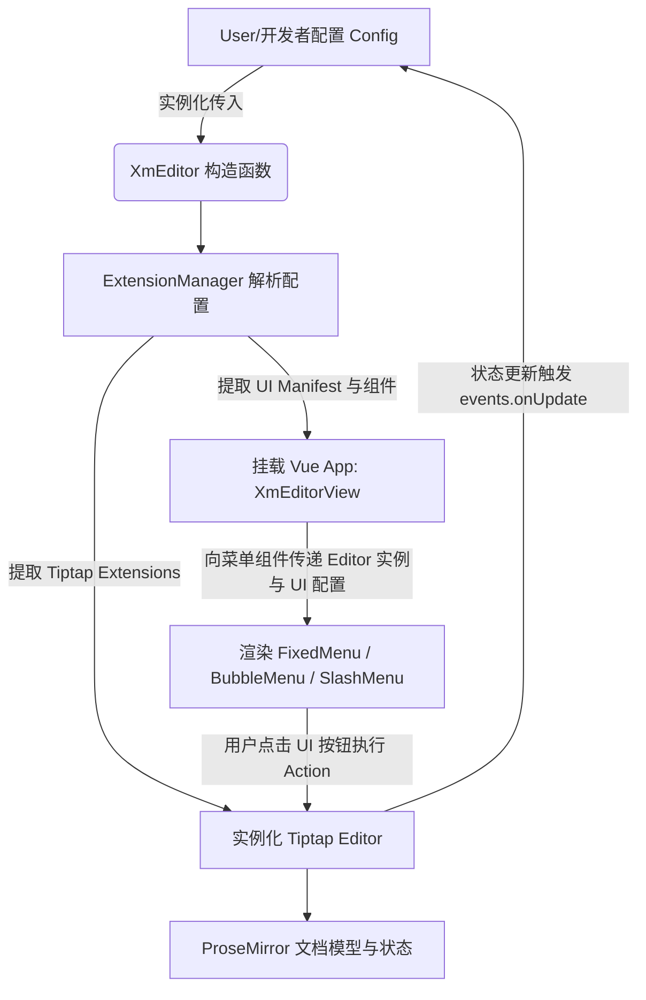
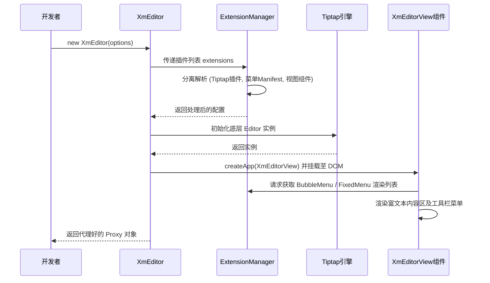

# Xm-Editor AI 项目理解文档

## 1. 项目架构概览 (Architecture Overview)
- **项目定位**：基于 Vue 3 和 Tiptap 封装的轻量级、高可定制富文本编辑器组件 (`@putanut/xm-editor`)。
- **技术栈**：
  - **核心富文本引擎**：`@tiptap/core` (底层基于 ProseMirror)。
  - **视图渲染层**：`Vue 3` + `@tiptap/vue-3`。
  - **UI 交互层**：`@floating-ui/dom/vue` + `tippy.js` (浮动菜单绝对定位)，`lucide-vue-next` (矢量图标库)。
  - **构建与开发**：`Vite`。
- **核心架构思想**：**插件化与 UI 数据驱动**。编辑器所有功能（包括粗体、代码块等核心能力及气泡菜单、固定菜单等UI）均作为独立 Extension 注入，通过 `ExtensionManager` 统一调度。支持通过预设 (Presets) 快速生成不同产品形态（如 NotionLike、Basic、Comment）。

## 2. 核心模块功能说明 (Core Modules)
- `src/core/XmEditor.js`：**编辑器主入口类**。负责初始化 Tiptap 实例，创建 ExtensionManager，并将 Vue 编辑器视图组件 (`XmEditorView.vue`) 动态挂载至用户指定的 DOM 元素上，最终返回 Proxy 代理对象。
- `src/core/ExtensionManager.js`：**扩展解析与分发器**。负责解析用户传入的插件列表，分离出底层的 Tiptap extensions 和 UI 的表现层数据 (Manifest，如 fixedMenu, bubbleMenu, slashMenu 配置)，并提供查询接口给 Vue 组件。
- `src/core/XmEditorView.vue`：**UI 根视图**。渲染 Tiptap 的 `<editor-content>` 并通过获取 ExtensionManager 中的组件挂载各类菜单（`BubbleMenu`, `FixedMenu`）。
- `src/core/proxyEditor.js`：**API 代理**。对暴露给开发者的编辑器方法进行一层封装（如 `getHTML()`, `getJSON()`, `setContent()`, `focus()` 等），隐藏 Tiptap 的底层复杂性。
- `src/utils/extensionUtil.js`：**扩展定义规范工具**。提供 `defineExtension` 函数，规范化插件的数据结构，将 Tiptap 逻辑和 UI 配置强内聚。

## 3. 依赖关系分析 (Dependencies)
- **底层驱动**：依赖 `@tiptap/core` 及一系列 `@tiptap/extension-*` 官方插件（版本 `^3.3.1`）。
- **代码高亮**：使用 `lowlight` (`^3.2.0`) 配合 `@tiptap/extension-code-block-lowlight` 实现代码语法高亮。代码主题由 `src/utils/themeLoader.js` 动态引入 `public/code-themes/` 下的 CSS 文件。
- **悬浮与提示**：`tippy.js` 和 `@tiptap/suggestion` 结合实现 Slash 命令菜单 (`/` 触发) 和 `@` 提及菜单。

## 4. 数据流向图 (Data Flow Diagram)


## 5. 关键类/函数接口定义 (Key Interfaces)
### 5.1 XmEditor (核心类)
```javascript
// 初始化
const editor = new XmEditor({
  el: HTMLElement, // 挂载节点
  config: Object   // Presets 预设配置，包含 extensions, editorOption 等
});
```

### 5.2 暴露的 ProxyEditor (API)
- `getHTML() -> String`: 获取富文本 HTML 内容。
- `getJSON() -> Object`: 获取 JSON AST 结构。
- `setContent(content)`: 回显内容，支持 HTML 字符串或 JSON。
- `getCursor() -> Object`: 获取当前光标/选区状态。

### 5.3 Extension 结构 (基于 `defineExtension`)
```javascript
export default defineExtension({
  name: 'extension-name', // 唯一标识
  type: 'node' | 'mark' | 'menu',
  extension: TiptapExtension, // 原生 tiptap 扩展
  manifest: {
    fixedMenu: { icon, label, action, isActive, shouldShow },
    bubbleMenu: { /* 类似 fixedMenu */ },
    slashMenu: [ /* Slash命令项数组 */ ]
  },
  component: VueComponent // 若为 UI 级扩展（如 FixedMenu），则包含组件引用
})
```

## 6. 配置文件说明 (Config Files)
- `package.json`: 声明了 `exports` 字段以支持 ESM (`import`) 与 UMD (`require`) 的构建产物，同时导出了多套内置样式 (`xm-editor.css`, `xm-editor-notion.css` 等)。
- `vite.config.js`: 项目工程配置。使用了 `vite-plugin-static-copy` 将 `public/code-themes` 同步至产物中，且启用了 CSS 分离打包以便支持按需引入样式。

## 7. 业务逻辑流程图 (Business Logic Flow Diagram)


## 8. 测试用例覆盖情况 (Test Coverage)
- **当前状态**: 代码库中目前缺乏 `tests` 或 `__tests__` 目录，尚未配置单元测试 (Unit Tests) 或端到端测试 (E2E Tests)。
- **后续建设建议**: 
  - 需引入 `Vitest` 测试核心逻辑（如 `ExtensionManager` 的 manifest 解析准确性、`proxyEditor` 方法的正确映射）。
  - 使用 `@vue/test-utils` 验证富文本菜单状态 (`isActive`, `shouldShow`) 在光标移动时的响应性。

## 9. 技术难点与优化建议 (Technical Challenges & Suggestions)
### 潜在技术难点
1. **状态同步与渲染开销**: Tiptap 的状态（ProseMirror State）与 Vue 响应式系统的同步较为频繁。特别是当文档极大时，气泡菜单（`BubbleMenu`）通过计算 `shouldShow` 函数进行渲染控制，可能产生性能抖动。
2. **SlashMenu 与 Suggestion 的拦截**: `@tiptap/suggestion` 插件拦截输入时的键盘事件（如上下键选择、回车确认），其层叠上下文与 Vue 弹窗（如 Tippy.js）之间的焦点管理存在复杂性。

### 优化方向与建议
1. **全面引入 TypeScript**: 项目现大量依赖约定俗成的对象结构（如 `manifest`, `editorOption`），缺乏强类型约束。建议引入 TS，通过 Interface（如 `IExtensionManifest`, `IEditorConfig`）明确契约，大幅提高 AI 提示及开发者体验。
2. **按需加载 (Lazy Loading)**: 富文本高阶插件（如代码高亮 `lowlight`、表格等）体积较大。建议探索引入动态加载机制 (`() => import(...)`)，缩减基础包体积。
3. **暴露深层 UI 定制插槽 (Slots)**: 当前菜单由内部解析 Manifest 渲染，对于极致自定义 UI 的业务场景不够灵活。建议在 `XmEditorView.vue` 开放更多的 Scoped Slots（如 `<slot name="toolbar" :editor="editor" />`）。