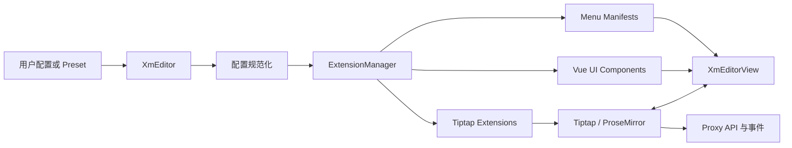

# XmEditor 项目现状分析与后续优化路线图

> 分析日期：2026-08-26  
> 分析对象：`@putanut/xm-editor` 0.1.6  
> 当前分支：`feature/new-ai`  
> 分析范围：项目架构、核心实现、扩展体系、构建发布、测试与工程化、同类开源项目能力对照

## 1. 总体结论

XmEditor 已经不是简单的富文本编辑器 Demo，而是一个具备完整产品轮廓的 Vue 3 + Tiptap 编辑器组件库。项目已经实现扩展体系、三套 Preset、Slash Menu、Bubble Menu、Fixed Menu、表格、目录、拖拽、图片上传和代码块等主要能力，具备继续产品化的基础。

目前项目仍处于“功能开发较快、工程化基础偏弱”的 0.x 阶段：

| 维度 | 当前评价 | 说明 |
| --- | --- | --- |
| 产品完整度 | 中等 | 核心编辑功能已成形，高级内容块、协同和审阅能力仍缺失 |
| 架构可扩展性 | 较好 | Extension Manifest 和 Preset 的方向正确 |
| 工程成熟度 | 偏低 | 缺少类型、测试、代码质量和发布验证体系 |
| 性能与包体积 | 需要重点治理 | 基础产物体积较大，按需加载能力不足 |
| 生产可用性 | 中低 | 生命周期、配置隔离和多实例行为仍存在风险 |

下一阶段建议先完成一次“质量与架构收口”，再扩展协同、评论和 AI 等高级功能。当前不宜继续单纯增加按钮或 Extension 数量。

## 2. 项目定位与技术架构

### 2.1 项目定位

XmEditor 当前适合定位为：

> Vue 生态中轻量、可组装、中文体验完善、业务接入成本低的 Tiptap 编辑器套件。

相较于直接封装 Tiptap，XmEditor 的核心价值在于：

- 提供可直接使用的编辑器产品形态，而不只是编辑内核。
- 用统一的 Extension Manifest 描述编辑逻辑和菜单 UI。
- 通过 Preset 适配文档、CMS、评论框等不同场景。
- 提供表格、目录、拖拽、代码块等需要较多交互开发的高级能力。

### 2.2 核心模块

| 模块 | 主要职责 |
| --- | --- |
| `src/core/XmEditor.js` | 解析配置、创建 Tiptap Editor、动态挂载 Vue UI、创建代理 API |
| `src/core/ExtensionManager.js` | 收集 Tiptap Extension、菜单 Manifest 和 UI 组件 |
| `src/core/XmEditorView.vue` | 渲染编辑区域、菜单、目录、拖拽手柄和表格辅助 UI |
| `src/core/proxyEditor.js` | 封装内容、光标、字体、行高和目录等外部 API |
| `src/utils/extensionUtil.js` | 规范自定义 Extension 的结构和配置方法 |
| `src/utils/presetUtil.js` | 合并 Preset 默认配置和用户覆盖配置 |
| `src/presets/*` | 提供 NotionLike、Basic 和 Comment 三种产品形态 |

### 2.3 主要数据流



当前实际代码尚未形成独立的“配置规范化”模块，该步骤是后续推荐补充的关键架构层。

## 3. 当前已有优势

### 3.1 Extension-First 方向正确

`ExtensionManager` 能够统一收集：

- Tiptap Extension
- Fixed Menu 配置
- Bubble Menu 配置
- Slash Menu 配置
- Suggestion 配置
- Vue UI 组件
- TOC、DragHandle、Table 等特殊组件配置

这种结构优于将所有功能直接写进固定工具栏，扩展可以同时贡献编辑能力和 UI，并能够通过 Preset 组合。

### 3.2 已经形成多场景 Preset

项目提供三种预设：

- `NotionLike`：完整文档编辑体验。
- `Basic`：带固定工具栏的通用富文本编辑器。
- `Comment`：面向评论、聊天等轻量输入场景。

Preset 支持按照 Extension 名称进行覆盖，便于业务定制单个扩展，而无需重新声明全部扩展。

### 3.3 高级功能具有一定实现深度

#### 表格

当前已经支持：

- 插入指定行列数的表格。
- 增删行列。
- 合并和拆分单元格。
- 切换表头。
- 调整列宽。
- 设置单元格背景色。
- 右键菜单。
- 表格边缘快捷增加行列。

#### 图片

当前已经支持：

- 自定义上传处理器。
- 工具栏选择文件上传。
- 粘贴图片上传。
- 拖放图片上传。
- URL 插入。
- 图片宽高调整。

#### 代码块

当前已经支持：

- Lowlight 语法高亮。
- 语言搜索和切换。
- 行号展示。
- 复制代码。
- 动态代码主题。

#### 目录

当前已经支持：

- 从标题自动提取目录。
- 自定义标题层级。
- 点击滚动到标题。
- 滚动时高亮当前标题。
- 左右位置配置。
- Panel 和 Data 两种使用方式。

#### Suggestion 基础设施

Slash Menu 和 Emoji 已经复用了通用 Suggestion 弹层和键盘导航逻辑，这为后续增加 Mention、AI 命令和自定义实体提供了基础。

## 4. 当前主要问题与风险

## 4.1 P0：生命周期与实例清理不完整

`XmEditor` 内部通过 `createApp()` 动态创建 Vue App，但对外返回的是 Proxy。Proxy 中的 `destroy()` 只调用 `editor.destroy()`，没有调用 Vue App 的 `unmount()`。

可能产生的问题：

- Vue 组件和监听器没有完整清理。
- 多次创建、销毁编辑器后可能出现内存泄漏。
- 动态挂载的弹层或全局事件可能残留。
- `onUnmounted` 中注册的清理逻辑可能无法正常执行。

建议将 Vue App、Tiptap Editor、Suggestion Popup 和外部 DOM 节点统一交给一个 Runtime 管理，并保证 `destroy()` 幂等。

```js
destroy() {
  if (this.destroyed) return
  this.destroyed = true
  this.vueApp?.unmount()
  this.tiptapEditor?.destroy()
  this.element?.replaceChildren()
}
```

## 4.2 P0：配置解析和实例隔离存在风险

当前构造器直接读取 `options.config.name`，当 `config` 未传入时会抛出异常。

另外，Preset 合并是浅合并。在用户没有覆盖 Extensions 时，默认扩展数组可能继续被复用；TOC 事件注入逻辑会直接修改 `config.extensions` 中的元素，存在多个编辑器实例共享和污染默认配置的风险。

建议增加不可变的配置规范化流程：

```text
用户配置
  → 参数校验
  → 解析 Preset
  → 深层复制可变配置
  → 合并 Extension
  → 检查重复、依赖和冲突
  → 生成只读 RuntimeConfig
```

同时建议明确：

- `config` 是否必填。
- `extensions` 和 `config.extensions` 同时存在时的优先级。
- 同名扩展的覆盖规则。
- Extension 缺少依赖时的错误行为。
- 一个配置对象能否安全创建多个编辑器实例。

## 4.3 P0：公开配置与实际行为不一致

README 和 Preset 中公开了以下配置：

- `editorOption.contentType`
- `editorOption.debounce`
- 菜单项 `priority`
- 菜单项 `shouldShow`

但当前核心运行逻辑没有完整消费这些配置：

- `contentType` 没有参与内容解析或输出策略。
- `debounce` 没有应用到核心 `onUpdate` 回调。
- 菜单项没有按照 `priority` 排序。
- Fixed/Bubble Menu 没有统一按照 `shouldShow` 过滤菜单项。

建议建立“文档即契约”的 API 测试，所有 README 中公开的配置都必须有自动化测试覆盖。

## 4.4 P0：构建产物体积过大

本次实测构建结果：

| 产物 | 原始体积 | gzip 体积 |
| --- | ---: | ---: |
| `xm-editor.es.js` | 约 4.12 MB | 约 908.76 KB |
| `xm-editor.umd.js` | 约 3.03 MB | 约 755.40 KB |
| Demo JS | 约 3.09 MB | 约 784.40 KB |

Demo 构建已经触发 Vite 的大 Chunk 警告。

主要原因包括：

1. `src/extensions/index.js` 一次性导入所有扩展，消费者难以真正按需加载。
2. CodeBlock 使用 `createLowlight(all)`，打入全部语言定义。
3. 大量 Tiptap/Vue UI 依赖进入最终 Bundle。
4. Collaboration、Yjs 等当前未使用依赖仍存在于 dependencies 中。
5. Table、CodeBlock、Emoji 等重型功能没有独立入口或懒加载机制。

建议目标：

- 基础编辑器 gzip 小于 150 KB。
- NotionLike 完整预设 gzip 小于 350 KB。
- CodeBlock、Table、Collaboration 可以独立加载。
- 构建阶段自动检查包体积预算。

具体措施：

- 增加子路径导出，例如：

```json
{
  "exports": {
    ".": "./dist/index.js",
    "./core": "./dist/core.js",
    "./presets/notion-like": "./dist/presets/notion-like.js",
    "./extensions/image": "./dist/extensions/image.js",
    "./extensions/code-block": "./dist/extensions/code-block.js"
  }
}
```

- 将 Vue、Tiptap 核心依赖整理为 Peer Dependencies。
- Lowlight 改为用户注册语言或默认只注册常用语言。
- 对重型 NodeView 和数据集采用动态导入。
- 检查并移除未使用的生产依赖。

## 4.5 P0：CommonJS 发布入口存在问题

`package.json` 设置了 `"type": "module"`，但将 `dist/xm-editor.umd.js` 声明为 `require` 入口。本次实测 CommonJS `require()` 没有暴露 `XmEditor`、`Extensions` 和 `Presets`。

建议：

- 若继续支持 CommonJS，生成明确的 `.cjs` 文件。
- 若只支持 ESM，则删除误导性的 `require` 条件和 `main` 配置。
- 增加对最终 npm 包的安装冒烟测试，而不是只测试源码构建。

发布验证至少应覆盖：

1. ESM import。
2. CommonJS require，若声明支持。
3. Vite Vue 项目安装和构建。
4. Nuxt/SSR 环境 import。
5. CSS 子路径导入。
6. `npm pack` 后的文件清单和体积。

## 4.6 P0：自动化质量体系缺失

当前项目没有完整的：

- 单元测试。
- Vue 组件测试。
- 浏览器 E2E 测试。
- Lint 和格式检查。
- Type Check。
- 发布工作流。
- Bundle Size 检查。
- API 兼容性检查。

现有 GitHub Actions 主要负责 Demo 部署，无法阻止功能回归进入主分支。

建议测试分层：

| 层级 | 工具建议 | 重点对象 |
| --- | --- | --- |
| 单元测试 | Vitest | Preset 合并、ExtensionManager、Proxy、TOC 工具函数 |
| 组件测试 | Vitest + Vue Test Utils | 菜单状态、弹层、NodeView、上传状态 |
| 编辑器集成测试 | Vitest Browser Mode | 输入规则、选区、Transaction、粘贴 |
| E2E | Playwright | Slash、表格、图片、拖拽、中文输入法、快捷键 |
| 视觉回归 | Playwright Screenshot | 三套主题、菜单、表格、代码块、移动端 |
| 发布测试 | Pack + Fixture Apps | ESM、CJS、Vite、Nuxt、CSS 导入 |

优先覆盖场景：

- Preset 配置隔离和多个实例并存。
- 编辑器销毁后的监听器和 DOM 清理。
- 中文输入法组合输入。
- Slash/Emoji 的上下键、回车和 Escape。
- 表格单元格选择、右键菜单和增删操作。
- 图片上传成功、失败、取消、粘贴和拖放。
- Safari/Firefox 的剪贴板和选区行为。
- 不同编辑器实例使用不同主题。

## 4.7 P1：Vue 集成方式不够自然

当前 `XmEditor` 内部调用 `createApp()`，对于 Vue 组件库会限制：

- `v-model`。
- Provide/Inject。
- Scoped Slots。
- 宿主应用主题上下文。
- SSR/Nuxt。
- Vue 错误边界。
- DevTools 组件树。
- 外部工具栏和状态复用。

建议同时提供声明式组件 API：

```vue
<XmEditor
  v-model="content"
  content-format="json"
  :extensions="extensions"
  :editable="editable"
  @update="handleUpdate"
>
  <template #toolbar="{ editor }">
    <CustomToolbar :editor="editor" />
  </template>

  <template #slash-item="{ item, active }">
    <CustomSlashItem :item="item" :active="active" />
  </template>
</XmEditor>
```

同时增加：

- `useXmEditor()` Composable。
- `useEditorState()`。
- `useEditorCommands()`。
- `useEditorUpload()`。

现有命令式 Class API 可以保留，用于非 Vue 场景和渐进式接入。

## 4.8 P1：主题系统不支持可靠的多实例和离线环境

当前代码主题加载器使用全局固定 DOM ID，并从 CDN 加载 CSS，可能导致：

- 多个编辑器无法使用不同代码主题。
- 一个实例会替换另一个实例的主题。
- 离线、内网或严格 CSP 环境加载失败。
- 仓库中已经复制到产物的本地代码主题没有被实际使用。

建议：

- 代码主题改为静态导入或局部 Class。
- 通过 CSS Variables 定义颜色、间距、圆角、边框、阴影和字体 Token。
- 避免用全局 ID 管理编辑器实例资源。
- 提供 Light、Dark、System 三种模式。
- 允许业务传入完整 Design Tokens。

## 4.9 P1：可访问性和国际化不足

当前多个菜单使用可点击 `div`，缺少完整的：

- Button 语义。
- 键盘焦点。
- `aria-label`。
- `aria-pressed`。
- `role=listbox/option`。
- `aria-selected`。
- 焦点可见样式。
- 减少动画偏好支持。

Slash Menu 的分类名称、空状态和大量 UI 文案直接使用中文常量，也不利于英文或业务自定义。

建议：

- 建立统一的无障碍菜单和按钮基础组件。
- 参考 WAI-ARIA Toolbar、Menu、Listbox 交互模式。
- 提供 `locale` 和 `messages` 配置。
- 内置 `zh-CN`、`en-US`，允许业务覆盖单个文案。
- 建立 Chrome、Firefox、Safari 的最低版本矩阵。

## 5. 同类优秀开源项目对照

### 5.1 BlockNote

项目地址：<https://github.com/TypeCellOS/BlockNote>

值得参考：

- 明确的 Block Schema 和自定义块 API。
- 嵌套、缩进、拖拽等一致的块级交互。
- 文件上传抽象。
- Yjs 实时协作。
- 完整的示例和文档站。
- Vitest 和浏览器测试体系。

对 XmEditor 的启示：不应只把“块级编辑”理解为拖拽手柄，应逐步形成稳定的 Block ID、Block Schema、块转换和自定义块契约。

### 5.2 Novel

项目地址：<https://github.com/steven-tey/novel>

值得参考：

- 聚焦 Notion 风格体验，而不是无限扩展功能面。
- AI 补全与编辑交互结合紧密。
- Slash、Bubble Menu 和 AI 能力形成统一产品流程。
- 提供较清晰的部署和业务集成示例。

对 XmEditor 的启示：AI 能力应融入选区、Slash 和流式编辑，不应只是增加一个调用接口的按钮。

### 5.3 Plate

项目地址：<https://github.com/udecode/plate>

值得参考：

- 插件体系和模板分层。
- AI 编辑能力和后端模板。
- 可复制到业务中的 UI 组件模式。
- 大文档性能 Benchmark。
- 完善的 Monorepo、版本和变更集管理。

对 XmEditor 的启示：可以提供“核心包 + 可选扩展包 + 业务模板”，而不是让所有能力进入一个大包。

### 5.4 Lexical

项目地址：<https://github.com/facebook/lexical>

值得参考：

- 对可靠性、性能和可访问性的明确承诺。
- 浏览器支持矩阵。
- JSON、HTML、Markdown 序列化。
- Yjs 协同。
- TypeScript 类型安全。
- 单元、集成和 E2E 测试分层。

对 XmEditor 的启示：编辑器基础设施的竞争力不仅是功能数量，更在于状态可靠性、兼容性、类型契约和升级稳定性。

## 6. 后续功能路线图

## 6.1 第一阶段：达到“可靠可用”标准

建议先完成 1～2 个版本的基础治理。

### TypeScript 化

优先迁移核心模块，并定义：

- `EditorConfig`
- `EditorOptions`
- `EditorEvents`
- `ExtensionDefinition`
- `ExtensionManifest`
- `FixedMenuItem`
- `BubbleMenuItem`
- `SlashMenuItem`
- `UploadHandler`
- `UploadState`
- `EditorInstance`

发布包必须包含 `.d.ts`，并对公开 API 进行类型测试。

### 稳定 Vue API

- 增加 `<XmEditor>` 组件。
- 支持 `v-model`。
- 支持 HTML/JSON/Markdown 内容格式。
- 提供 Scoped Slots。
- 提供 Composables。
- 增加只读模式。
- 明确响应式属性和初始化后不可变属性。

### 内容生命周期

新增或完善：

- `onSelectionUpdate`
- `onTransaction`
- `onContentError`
- 真正生效的 Update Debounce
- 内容校验
- JSON Schema 版本号
- 文档迁移器
- 自动保存状态：`idle / dirty / saving / saved / error`

### Markdown 与剪贴板

- Markdown 导入。
- Markdown 导出。
- 粘贴 Markdown 自动识别。
- HTML 白名单清洗。
- 纯文本粘贴策略。
- Word/飞书等来源的粘贴清理策略。

### 上传管理器

将图片上传扩展为统一资源上传体系：

- 上传进度。
- 失败状态和重试。
- 取消上传。
- 上传占位节点。
- 文件大小和 MIME 校验。
- 并发限制。
- URL 替换。
- 图片、附件、音视频共享上传协议。

## 6.2 第二阶段：补齐现代文档编辑体验

### 推荐新增内容块

- Callout/提示块。
- Details/折叠块。
- 文件附件。
- Bookmark/网页卡片。
- 视频和音频。
- 数学公式。
- Mermaid/流程图。
- 多栏布局。
- Mention。
- 日期、状态、标签等 Inline Entity。

### 推荐增强交互

- 块复制、删除、转换、上下移动菜单。
- 块 ID 和块级 API。
- 全局命令面板。
- 搜索与替换。
- 文档模板。
- 字数统计和阅读时间。
- 全屏模式。
- 专注模式。
- 移动端工具栏。
- 可配置快捷键中心。

## 6.3 第三阶段：协同、审阅与历史

项目已经声明 Yjs 和 Collaboration 依赖，但尚未形成真正的产品能力。建议将协同能力作为独立可选包实现。

推荐功能：

- 多人光标和用户信息。
- 在线状态和同步状态。
- 断线重连。
- 本地离线缓存。
- 只读用户和权限策略。
- 评论线程。
- Mention 通知接口。
- 建议/修订模式。
- 版本快照。
- 历史版本比较和恢复。

在实现协同前，必须先稳定：

- Schema 版本。
- 文档迁移器。
- Extension 唯一标识。
- Block ID。
- 自动化回归测试。

## 6.4 第四阶段：AI 编辑能力

当前分支名为 `feature/new-ai`，但代码中尚未形成完整 AI 能力。建议 AI 扩展保持 Provider-Neutral，不直接绑定单一服务。

### 推荐能力

- 续写。
- 改写。
- 扩写和缩写。
- 翻译。
- 总结。
- 调整语气。
- 根据选区生成标题、列表或表格。
- `/ai` Slash 命令。
- 选区 Bubble AI 菜单。
- 流式插入和停止生成。
- 一键撤销本次生成。
- 自定义 Prompt。
- 业务知识上下文注入。
- 大文档按选区、标题或块构建上下文。

### 推荐交互原则

- AI 输出先预览，再接受或拒绝。
- 不直接覆盖用户原文。
- 每次 AI 修改作为一个可撤销 Transaction。
- 明确生成中、失败、取消和重试状态。
- API Key 通过业务服务端代理，编辑器前端不保存密钥。
- AI Provider 只负责流和结果，编辑器负责选区、Transaction 和 UI。

建议接口：

```ts
interface AIProvider {
  stream(request: AIRequest, signal: AbortSignal): AsyncIterable<AIChunk>
}

interface AIRequest {
  action: string
  selectedText?: string
  documentContext?: unknown
  prompt?: string
  locale?: string
}
```

## 7. 推荐实施优先级

| 优先级 | 工作内容 | 目标 |
| --- | --- | --- |
| P0 | 生命周期、实例隔离、配置规范化 | 消除内存泄漏和多实例污染风险 |
| P0 | TypeScript、测试、Lint、CI | 建立可靠变更基础 |
| P0 | 包结构、子路径导出、Lowlight 拆分 | 显著降低包体积 |
| P0 | 修复 ESM/CJS 发布入口 | 保证 npm 包真实可用 |
| P1 | Vue 组件 API、v-model、Slots、Composables | 降低 Vue 项目接入成本 |
| P1 | Markdown、内容校验、迁移、自动保存 | 稳定内容生命周期 |
| P1 | 上传管理器、主题、多实例、i18n、A11y | 提升生产环境适配能力 |
| P2 | 新内容块、模板、搜索、移动端 | 补齐现代文档体验 |
| P2 | Yjs 协同、评论、版本历史 | 进入团队文档和知识库场景 |
| P3 | AI Provider、流式生成和预览接受 | 建立差异化能力 |

## 8. 建议迭代拆分

### Milestone 1：Core Stability

- 修复完整销毁流程。
- 配置不可变化和实例隔离。
- 移除生产环境调试日志。
- 对齐 README 配置和实际行为。
- 修复 CommonJS 或明确只支持 ESM。
- 建立 Vitest 基础测试。

验收标准：

- 连续创建和销毁 100 次无明显监听器或 DOM 残留。
- 同一 Preset 创建多个实例时配置互不影响。
- README 所有公开配置具有测试。
- ESM/SSR/样式导入冒烟测试通过。

### Milestone 2：Package & Vue API

- 核心模块 TypeScript 化。
- 提供 Vue 组件和 Composable。
- 增加子路径导出。
- Lowlight 语言按需注册。
- 整理 Peer Dependencies。
- 增加 Bundle Size CI。

验收标准：

- 基础包 gzip 小于 150 KB。
- 完整 Preset gzip 小于 350 KB。
- 类型声明完整。
- Vite 和 Nuxt Fixture 构建通过。

### Milestone 3：Content Platform

- Markdown 导入导出。
- 内容 Schema 版本和迁移。
- 自动保存状态。
- 上传管理器。
- HTML 清洗和粘贴策略。
- i18n 和可访问性整改。

验收标准：

- HTML、JSON、Markdown 可以稳定往返。
- 上传失败可以重试和取消。
- 核心菜单可以完全使用键盘操作。
- 中文和英文界面不依赖硬编码文案。

### Milestone 4：Collaboration & AI

- Yjs 协同扩展包。
- 评论、Mention、版本快照。
- AI Provider 接口。
- 选区 AI、Slash AI、流式预览。

验收标准：

- 多客户端同步、断线重连和版本升级测试通过。
- AI 操作可以取消、重试、接受、拒绝和一次撤销。
- 编辑器包不包含任何服务商密钥或固定后端依赖。

## 9. 工程治理建议

### 推荐脚本

```json
{
  "scripts": {
    "lint": "eslint .",
    "typecheck": "vue-tsc --noEmit",
    "test": "vitest run",
    "test:browser": "vitest --browser",
    "test:e2e": "playwright test",
    "test:package": "node scripts/test-package.mjs",
    "size": "size-limit",
    "check": "pnpm lint && pnpm typecheck && pnpm test && pnpm build && pnpm size"
  }
}
```

### 推荐 CI

每个 Pull Request 至少执行：

1. Frozen Lockfile 安装。
2. Lint。
3. Type Check。
4. Unit/Component Tests。
5. Build。
6. Package Smoke Tests。
7. Bundle Size Check。
8. Chromium E2E。

主分支或定时任务再执行 Firefox、WebKit 和视觉回归测试。

### 推荐发布流程

- 使用 Changesets 或同类工具记录变更。
- 维护 `CHANGELOG.md`。
- 统一 Git Tag 和 `package.json` 版本。
- 发布前通过 Pack Fixture 验证最终包。
- 对公开 API 设置弃用周期。
- 明确 SemVer 兼容策略。

## 10. 最终建议

XmEditor 当前最有价值的部分不是扩展数量，而是已经形成了“扩展逻辑 + 菜单 Manifest + Vue UI + Preset”的完整构建思路。

后续工作的核心应从“继续增加功能”转向以下四点：

1. **可靠性**：生命周期、配置隔离、内容 Schema 和测试。
2. **开发者体验**：TypeScript、Vue 声明式 API、Slots 和文档契约。
3. **交付质量**：按需加载、包体积、发布验证和浏览器兼容。
4. **产品差异化**：中文体验、协同审阅和可替换 AI Provider。

完成 P0 和 P1 后，项目才会从“功能丰富的个人开源项目”进入“团队可以放心依赖的编辑器基础设施”。

